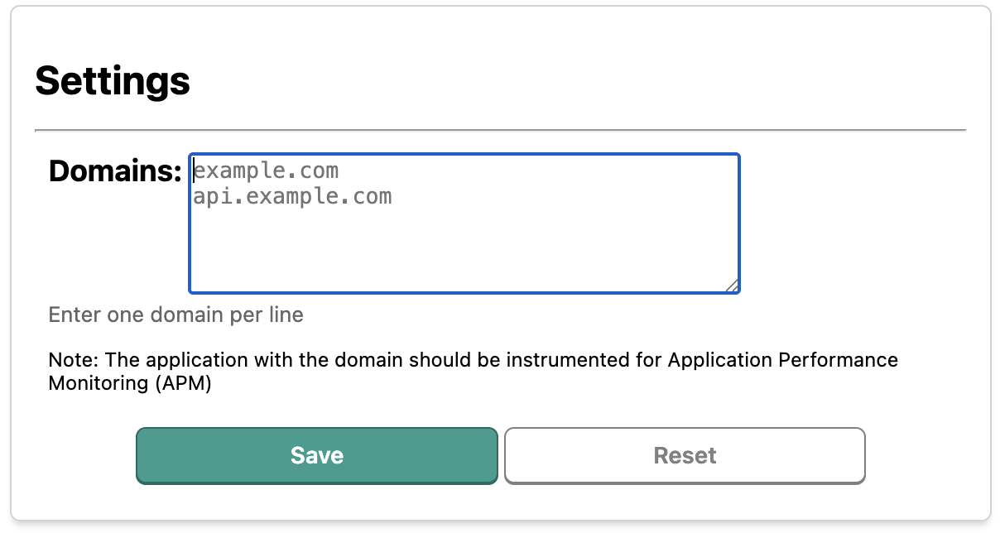

# Datadog APM Trace extension

Chromium extension to enable and retain Datadog APM traces from a local browser session.

Useful when debugging end to end application flows without worrying about retention filters.

## Features

- Configure multiple domains to trace (one per line)
- Automatic Datadog header injection (trace-id, parent-id, origin, sampling-priority)
- Direct link to view trace in Datadog APM
- Visual tab grouping for traced sessions
- Auto-cleanup when traced tab is closed

## Install

From [Chrome Web Store](https://chrome.google.com/webstore/detail/datadog-apm-tracer/jilpmibbdkjiigdofgpmclkmmehgdibb)

## Load Extension from source

- Clone this repo
- Open Chrome and navigate to `chrome://extensions/`
- Toggle on `Developer mode` in the top right corner
- Click `Load unpacked`
- Select the repository directory

## Use in Incognito mode

- From extensions page, click `Details` on Datadog Tracer extension
- Enable `Allow in Incognito` option

## Usage

1. Click extension icon → Options
2. Add domains to trace (one per line), click Save

   

3. Navigate to your instrumented application
4. Click extension icon → Toggle ON
5. Use the generated Trace ID or link to find your trace in Datadog

## Publish to Chrome Web Store

1. Update version in `manifest.json`
2. Run `pnpm zip` to create the package
3. Go to [Chrome Web Store Developer Dashboard](https://chrome.google.com/webstore/devconsole)
4. Select the extension → **Package** tab → **Upload new package**
5. Update **Store listing** tab if needed (description, screenshots)
6. Click **Submit for review**

## Questions
Please create an issue

## Credits
- Extension icon <a href="https://www.flaticon.com/free-icons/trace" title="trace icons">Trace icons created by Bombasticon Studio - Flaticon</a>